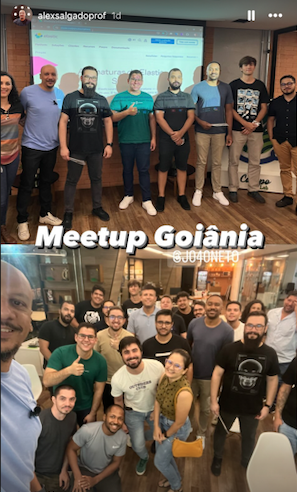

# Meetup Goiânia 2024

## Sobre o Evento

O Meetup Goiânia, que ocorreu no último dia 5/4, foi um evento incrível onde compartilhamos conhecimentos e experiências valiosas sobre os tópicos mais atuais da tecnologia. Foi uma grande oportunidade para networking e aprendizado mútuo.

## Fotos do Evento

Confira algumas fotos do nosso encontro:

## Materiais do Evento

Você pode encontrar todos os slides e materiais utilizados durante as apresentações [aqui](SlidesMeetupGoiania.2024.pdf).

## Próximos Passos

Fique atento para os próximos eventos seguindo nossa página no [Elastic Community](https://www.elastic.co/pt/community) e participando do nosso grupo de discussão.

---

Agradecemos a todos que participaram e tornaram este meetup memorável! Até o próximo!
